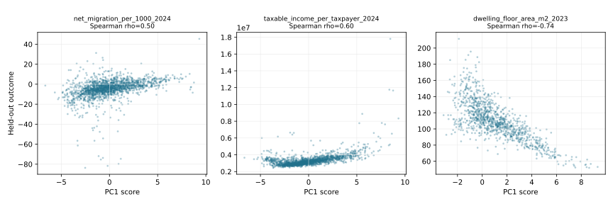

# PCAに基づく日本の市区町村の都市化指標 / PCA-Based Urbanization Index for Japanese Municipalities

This reproducible nationwide study examines municipal spatial concentration and employment structure in Japan. It uses official e-Stat releases, resolves overlapping city/ward geographies, separates model inputs from validation outcomes, and quantifies loading and rank stability.

## Main result

The primary analysis covers 1,740 of 1,741 non-overlapping basic municipal units in the 2024 publication. PC1 explains 80.27% of standardized variance. It increases with population and facility density, increases with tertiary-sector employment, and decreases with primary-sector employment.

The index is associated in the expected direction with three indicators that were held out of PCA and taken from the later 2026 release:

| Held-out outcome | n | Spearman rho | Bootstrap 95% interval |
|---|---:|---:|---:|
| 2024 net migration per 1,000 registered residents | 1,740 | 0.498 | [0.458, 0.535] |
| 2024 taxable income per taxpayer | 1,740 | 0.597 | [0.556, 0.636] |
| 2023 floor area per dwelling | 1,059 | -0.738 | [-0.772, -0.700] |

These are descriptive associations, not causal effects or an official government urbanization score.



*外部検証：PCA に使用しなかった後続指標との順位相関と 95% ブートストラップ区間。 / External validation: rank correlations with later indicators excluded from PCA, with 95% bootstrap intervals.*

## Reproduce

Python 3.9–3.12 is required; `requirements.lock` pins the full tested dependency graph.

```bash
make setup
make reproduce
```

`make reproduce` uses the reviewed processed snapshot committed under `data/processed/`. To rebuild that snapshot from the official workbooks:

```bash
make fetch
make prepare
make reproduce
```

Downloads are pinned by SHA-256. A changed upstream file causes a hard failure so revisions cannot silently alter the analysis.

## Outputs

- `REPORT.md`: complete study report, interpretation, sensitivity analyses, and limitations.
- `DATA_CARD.md`: variables, population, missingness, rights, and intended use.
- `results/municipality_scores.csv`: PC1/PC2 scores and bootstrap percentile-rank intervals.
- `results/pc1_loadings.csv`: coefficients, correlation loadings, and bootstrap intervals.
- `results/external_validation.csv`: held-out validation estimates and Holm-adjusted p-values.
- `results/sensitivity.csv`: preprocessing, feature-set, domain, and geography checks.
- `results/feature_spearman_correlations.csv`: rank correlations among the seven primary inputs.
- `results/data_quality.csv`: field-level coverage in the primary target population.
- `results/sample_flow.csv`: deterministic row-accounting audit trail.
- `results/original_per_capita_pc1_loadings.csv`: exact loadings for the baseline per-capita feature specification.
- `results/figures/`: deterministic SVG figures.
- `provenance/SOURCE_AUDIT.md`: audit of the official sources, transformations, and publication boundary.

## What was corrected

- Replaced a missing filename reference with a deterministic data builder.
- Replaced a small, undocumented sample specification with the full non-overlapping target population.
- Removed circular validation against strata constructed from the same variables.
- Prevented double representation of designated cities and their wards.
- Moved DID population and cultivated-land variables to sensitivity analysis because official missingness is material.
- Replaced per-capita facility counts in the primary index with facility density per inhabitable square kilometre. The original per-capita specification remains a reported sensitivity check.
- Added fixed seeds, pinned dependencies, tests, bootstrap stability, held-out validation, and source hashes.

## Status

This is a complete exploratory research artifact suitable for methods review and replication. It should not be used for funding allocation, municipal performance appraisal, or individual-level inference without a purpose-specific validation study.
